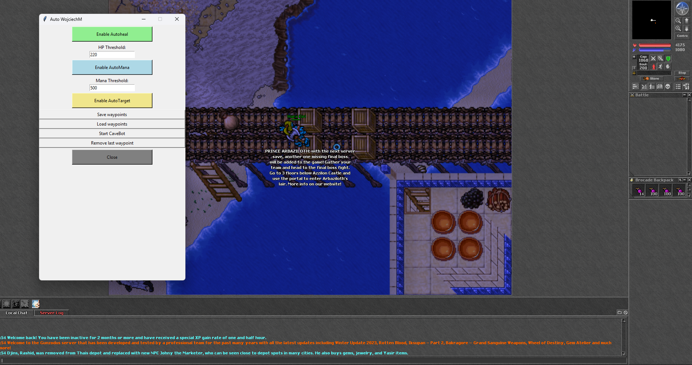
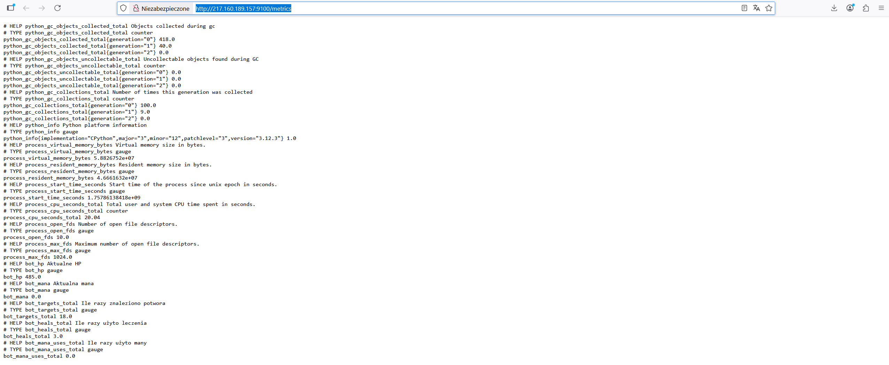

# Game-assistant-python-devops-project
A Python-based game assistant bot for Tibia with automated healing, mana, targeting, and cavebot features. Includes monitoring with Grafana and Prometheus, stores metrics in a database, and is ready for DevOps deployment with Docker and CI/CD.

      +-----------------+           JSON           +------------------------+
      |                 |  ------------------>   |                        |
      |  Local Bot       |                         |  Metrics Server (VPS) |
      |  (Windows)       |  <------------------  |  /metrics endpoint     |
      +-----------------+           HTTP           +------------------------+
             |                                           |
             |                                           |
             |                                           |
             |                                           |
             |                                           v
             |                             +------------------------+
             |                             |                        |
             |                             |      Prometheus        |
             |                             |  (Docker Container)   |
             |                             +------------------------+
             |                                           |
             |                                           |
             |                                           v
             |                             +------------------------+
             |                             |                        |
             +---------------------------> |        Grafana         |
                                           |  (Docker Container)   |
                                           +------------------------+
                                           |
                                           v
                                  Real-time dashboard / visualization
## Zrzuty ekranu

### Grafana Dashboard

### Interfejs GUI

### Prometheus

